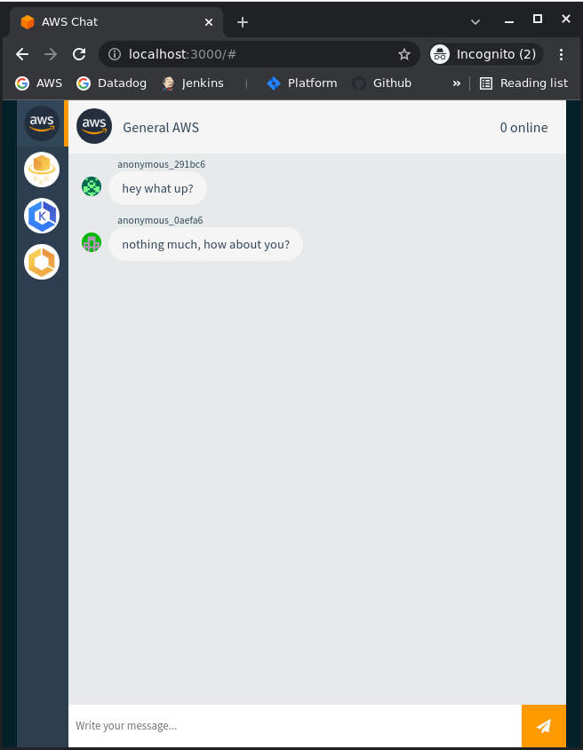
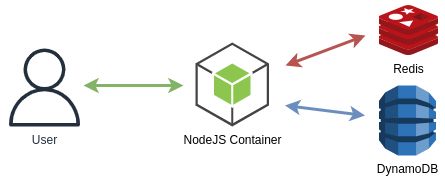

# AWS Chat App



A simple Slack-like chat app built with [Node.js](https://nodejs.org/en/) and [Vue.js](https://vuejs.org/).

## Run it locally

To run the application on your local machine you need:

- `docker`
- `docker-compose`
- `make`

Execute the following command:

```
make run
```

The application will be available at `http://localhost:3000`

If you make changes to the code, you can run:

```
make build
```

This updates the client application.

To run integration tests execute:

```
make test
```
**Notice:** Test suite is designed in a way that test cases expect the running client app to be newly launched, therefore if chat users are already stored in db, then test cases will fail (as number of expected users will differ), etc.

To stop the application execute:
```
make stop
```

---

## Architecture



The app makes use of the [socket.io-redis](https://github.com/socketio/socket.io-redis-adapter) adaptor, which uses [Redis](https://redis.io/) as a message broker to pass messages between Node.js processes.

[DynamoDB](https://aws.amazon.com/dynamodb/) is used to provide durable persistence for user accounts and message history. A local DynamoDB instance for testing is made available using [Localstack](https://localstack.cloud/).

---

## Challenges
Familiarise yourself with the application architecture. 

### 1 - Create the application Dockerfile
A Docker-compose file already exists for local testing, it has all the services configured, but we are missing the client application Dockerfile in `/src/client`.
Create a Dockerfile that runs the client application. 
- For the purposes of this application we will be using *Node 9*
- You can find some extra details for the client service in the docker-compose file
- Once you have completed your Dockerfile, run `make build` and check the image builds successfully
- Once your image is built, run the application with `make run` and check the application runs successfully and you can access it at http://localhost:3000/
- Once the application and its dependencies are running, check all the tests pass with `make test`

### 2 - Add REDIS_ENDPOINT environment variable
The Redis endpoint is currently hardcoded to the host used for local testing, this won't work when we deploy our application to AWS.
- Update the client application code to allow us to specify the redis host via `REDIS_ENDPOINT` environment variable
- Update the docker-compose file with the correct `REDIS_ENDPOINT` for local testing

### 3 - Configure Amazon Linux 2 AMI
The launch template is currently missing an AMI ID. The Terraform code won't validate because of this 
- Add the appropriate AMI ID for Amazon Linux 2 to the launch template

---

## Submission
Please submit your repo in its entirety.
You can send us a ZIP file or you can share a public fork with us.
